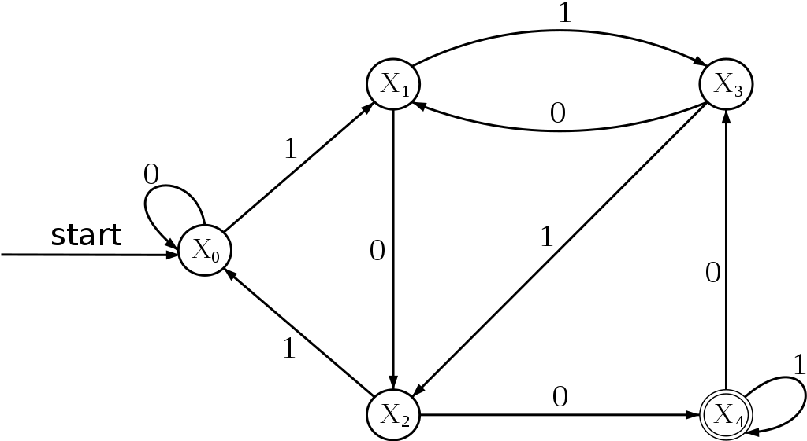

# Simple State Machine (SSM)

The implementation of a simple state machine.
Both in Go and Python.

### Golang:

1. Call main(), and loop forever.
2. Call reset(), initialize tape and control box.
3. Loop over the tape index.
4. Switch current state.
5. Print current state.
6. Determine content at tape index.
7. Set state or break.

### Python:

**Warning:** This edition of ssm in very call stack intensive.

1. Initialize tape,length,header
2. Call reset state (StateR).
3. The reset state sets up some variables and calls State0().
4. State0 determines content of tape at given index.
5. State0 calls next state.
